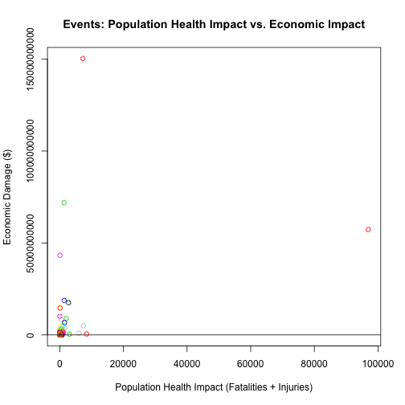

Which natural events are most harmful to population health and economy?
========================================================

# Synopsis
This analysis examines the United State National Oceanic and Atmospheric
Administration's (NOAA) storm database to determine the events that are most 
harmful to population health and economy. Findings indicate that floods are 
responsible for the maximum damage to the economy in terms of combined property
and crop damages, and tornadoes are the most devastating to population health 
in terms of combined fatalities and injuries. In terms of percentages, floods 
are responsible for **31.5%** of the total economic damage and tornadoes are 
responsible for **62.3%** of the damage to population health.


```r
opts_chunk$set(echo = TRUE)
# disable scientific notation
options(scipen = 9, warn = -1)
```

# Data Processing
The links to download the files necessary for this analysis are given below:
- [Storm Data](https://d396qusza40orc.cloudfront.net/repdata%2Fdata%2FStormData.csv.bz2)
- [Storm Data Documentation](https://d396qusza40orc.cloudfront.net/repdata%2Fpeer2_doc%2Fpd01016005curr.pdf)
- [FAQ](https://d396qusza40orc.cloudfront.net/repdata%2Fpeer2_doc%2FNCDC%20Storm%20Events-FAQ%20Page.pdf)

The data file is a BZip compressed archive. File is uncompressed and loaded 
into a data frame using the bzfile and read.csv functions.


```r
# data file download and processing
# set download url
furl <- "https://d396qusza40orc.cloudfront.net/repdata%2Fdata%2FStormData.csv.bz2"

# set filename
fname <- "NOAAstorm.csv.bz2"

# download file
download.file(furl, fname, method = "curl" )

# download documentation
download.file("https://d396qusza40orc.cloudfront.net/repdata%2Fpeer2_doc%2Fpd01016005curr.pdf", "NOAAStorm_doc.pdf", method ="curl")

# download FAQ file
download.file("https://d396qusza40orc.cloudfront.net/repdata%2Fpeer2_doc%2FNCDC%20Storm%20Events-FAQ%20Page.pdf", "NOAAStorm_FAQ.pdf", method ="curl")

# unzip file and load into data frame
stormdata <- read.csv(bzfile("NOAAstorm.csv.bz2"))
```

Structure of the data can be analyzed by the str command

```r
str(stormdata)
```

```
## 'data.frame':	902297 obs. of  37 variables:
##  $ STATE__   : num  1 1 1 1 1 1 1 1 1 1 ...
##  $ BGN_DATE  : Factor w/ 16335 levels "1/1/1966 0:00:00",..: 6523 6523 4242 11116 2224 2224 2260 383 3980 3980 ...
##  $ BGN_TIME  : Factor w/ 3608 levels "00:00:00 AM",..: 272 287 2705 1683 2584 3186 242 1683 3186 3186 ...
##  $ TIME_ZONE : Factor w/ 22 levels "ADT","AKS","AST",..: 7 7 7 7 7 7 7 7 7 7 ...
##  $ COUNTY    : num  97 3 57 89 43 77 9 123 125 57 ...
##  $ COUNTYNAME: Factor w/ 29601 levels "","5NM E OF MACKINAC BRIDGE TO PRESQUE ISLE LT MI",..: 13513 1873 4598 10592 4372 10094 1973 23873 24418 4598 ...
##  $ STATE     : Factor w/ 72 levels "AK","AL","AM",..: 2 2 2 2 2 2 2 2 2 2 ...
##  $ EVTYPE    : Factor w/ 985 levels "   HIGH SURF ADVISORY",..: 834 834 834 834 834 834 834 834 834 834 ...
##  $ BGN_RANGE : num  0 0 0 0 0 0 0 0 0 0 ...
##  $ BGN_AZI   : Factor w/ 35 levels "","  N"," NW",..: 1 1 1 1 1 1 1 1 1 1 ...
##  $ BGN_LOCATI: Factor w/ 54429 levels ""," Christiansburg",..: 1 1 1 1 1 1 1 1 1 1 ...
##  $ END_DATE  : Factor w/ 6663 levels "","1/1/1993 0:00:00",..: 1 1 1 1 1 1 1 1 1 1 ...
##  $ END_TIME  : Factor w/ 3647 levels ""," 0900CST",..: 1 1 1 1 1 1 1 1 1 1 ...
##  $ COUNTY_END: num  0 0 0 0 0 0 0 0 0 0 ...
##  $ COUNTYENDN: logi  NA NA NA NA NA NA ...
##  $ END_RANGE : num  0 0 0 0 0 0 0 0 0 0 ...
##  $ END_AZI   : Factor w/ 24 levels "","E","ENE","ESE",..: 1 1 1 1 1 1 1 1 1 1 ...
##  $ END_LOCATI: Factor w/ 34506 levels ""," CANTON"," TULIA",..: 1 1 1 1 1 1 1 1 1 1 ...
##  $ LENGTH    : num  14 2 0.1 0 0 1.5 1.5 0 3.3 2.3 ...
##  $ WIDTH     : num  100 150 123 100 150 177 33 33 100 100 ...
##  $ F         : int  3 2 2 2 2 2 2 1 3 3 ...
##  $ MAG       : num  0 0 0 0 0 0 0 0 0 0 ...
##  $ FATALITIES: num  0 0 0 0 0 0 0 0 1 0 ...
##  $ INJURIES  : num  15 0 2 2 2 6 1 0 14 0 ...
##  $ PROPDMG   : num  25 2.5 25 2.5 2.5 2.5 2.5 2.5 25 25 ...
##  $ PROPDMGEXP: Factor w/ 19 levels "","-","?","+",..: 17 17 17 17 17 17 17 17 17 17 ...
##  $ CROPDMG   : num  0 0 0 0 0 0 0 0 0 0 ...
##  $ CROPDMGEXP: Factor w/ 9 levels "","?","0","2",..: 1 1 1 1 1 1 1 1 1 1 ...
##  $ WFO       : Factor w/ 542 levels ""," CI","%SD",..: 1 1 1 1 1 1 1 1 1 1 ...
##  $ STATEOFFIC: Factor w/ 250 levels "","ALABAMA, Central",..: 1 1 1 1 1 1 1 1 1 1 ...
##  $ ZONENAMES : Factor w/ 25112 levels "","                                                                                                                               "| __truncated__,..: 1 1 1 1 1 1 1 1 1 1 ...
##  $ LATITUDE  : num  3040 3042 3340 3458 3412 ...
##  $ LONGITUDE : num  8812 8755 8742 8626 8642 ...
##  $ LATITUDE_E: num  3051 0 0 0 0 ...
##  $ LONGITUDE_: num  8806 0 0 0 0 ...
##  $ REMARKS   : Factor w/ 436781 levels "","\t","\t\t",..: 1 1 1 1 1 1 1 1 1 1 ...
##  $ REFNUM    : num  1 2 3 4 5 6 7 8 9 10 ...
```
As reflected by the output of the str command, the dataset contains 902297
observations of 37 variables. The variables that are of interest to us in this 
analysis are EVTYPE, FATALITIES, INJURIES, PROPDMG, PROPDMGEXP, CROPDMG, and
CROPDMGEXP. FATALITES and INJURIES are numeric variables that indicate the 
magnitude of damage to population health. PROPDMG and CROPDMG are numeric 
variables that store the value for property damage and crop damage respectively,
these variables need to be combined with an exponent that is stored in the 
PROPDMGEXP and CROPDMGEXP variables. The exponent variables store strings that
map to a numeric exponent. Values of H, T, M and B map to Hundreds, Thousands,
Millions and Billions respectively.


```r
# we will use the sqldf package to manipulate the dataset
library(sqldf)
```

```
## Loading required package: gsubfn
## Loading required package: proto
## Could not load tcltk.  Will use slower R code instead.
## Loading required package: RSQLite
## Loading required package: DBI
## Loading required package: RSQLite.extfuns
```


```r
# subset data to pick out variables of interest for analysis
# TRANSFORM  PROPDMGEXP & CROPDMG variables from Char to Numeric
stormstaging <- sqldf("select EVTYPE, FATALITIES, INJURIES, PROPDMG, 
                     CASE PROPDMGEXP WHEN 'H' THEN 100
                                     WHEN 'K' THEN 1000
                                     WHEN 'M' THEN 1000000
                                     WHEN 'B' THEN 1000000000
                                     ELSE 1
                                     END PROPDMGMULTIPLIER,
                     CROPDMG,
                     CASE CROPDMGEXP WHEN 'H' THEN 100
                                     WHEN 'K' THEN 1000
                                     WHEN 'M' THEN 1000000
                                     WHEN 'B' THEN 1000000000
                                     ELSE 1
                                     END CROPDMGMULTIPLIER from stormdata")
names(stormstaging)
```

```
## [1] "EVTYPE"            "FATALITIES"        "INJURIES"         
## [4] "PROPDMG"           "PROPDMGMULTIPLIER" "CROPDMG"          
## [7] "CROPDMGMULTIPLIER"
```

```r
# create transformed data frame
stormaggregate <- sqldf("select EVTYPE, FATALITIES, INJURIES,
                           (FATALITIES + INJURIES) HUMANDMG,
                           (PROPDMG * PROPDMGMULTIPLIER) TOTPROPDMG,
                           (CROPDMG* CROPDMGMULTIPLIER) TOTCROPDMG,
                           (PROPDMG * PROPDMGMULTIPLIER + 
                            CROPDMG* CROPDMGMULTIPLIER) ECODMG
                   from stormstaging")
names(stormaggregate)
```

```
## [1] "EVTYPE"     "FATALITIES" "INJURIES"   "HUMANDMG"   "TOTPROPDMG"
## [6] "TOTCROPDMG" "ECODMG"
```
# Results
A plot of the impact to population health against the impact to the economy 
should indicate whether events having a high population health impact also 
impact the economy proportionally.


```r
forplot <- sqldf("select EVTYPE, SUM(ECODMG) TOTECODMG,
                  SUM(HUMANDMG) TOTHUMDMG
                  from stormaggregate
                  group by EVTYPE")

# scatter plot with regression line
m <- lm(forplot$TOTHUMDMG~forplot$TOTECODMG)
plot(forplot$TOTHUMDMG, forplot$TOTECODMG,
     main = "Events: Population Health Impact vs. Economic Impact",
     xlab = "Population Health Impact (Fatalities + Injuries)",
     ylab = "Economic Damage ($)",
     col = forplot$EVTYPE)
abline(m)
```

 

As can be seen from the plot and the regression line, events having a high 
impact to population health do not necessarily have a proportional impact on 
the economy.

The Top 10 Events having the most impact to the economy 
(property damage + crop damage) are:

```r
# Print Top 10 Events causing maximum economic damage
sqldf("select EVTYPE, TOTECODMG
                 from forplot
                 order by TOTECODMG desc limit 10")
```

```
##               EVTYPE    TOTECODMG
## 1              FLOOD 150319678257
## 2  HURRICANE/TYPHOON  71913712800
## 3            TORNADO  57340614060
## 4        STORM SURGE  43323541000
## 5               HAIL  18752905438
## 6        FLASH FLOOD  17562129167
## 7            DROUGHT  15018672000
## 8          HURRICANE  14610229010
## 9        RIVER FLOOD  10148404500
## 10         ICE STORM   8967041360
```
The %age contribution of the top event to the total economic damage is:


```r
# Calculate % of Total for the top event causing max economic damage
sqldf("select EVTYPE Event, (TOTECODMG / ecodmgtot) * 100 PercentToTotal
       from forplot agg, (select sum(totecodmg) ecodmgtot from forplot) tot
       order by TOTECODMG desc limit 1")
```

```
##   Event PercentToTotal
## 1 FLOOD          31.56
```
The Top 10 Events having the most impact on population health
(Fatalities + Injuries) are:


```r
# Print Top 10 Events causing maximum damage to population health
sqldf("select EVTYPE, TOTHUMDMG
                 from forplot
                 order by TOTHUMDMG desc limit 10")
```

```
##               EVTYPE TOTHUMDMG
## 1            TORNADO     96979
## 2     EXCESSIVE HEAT      8428
## 3          TSTM WIND      7461
## 4              FLOOD      7259
## 5          LIGHTNING      6046
## 6               HEAT      3037
## 7        FLASH FLOOD      2755
## 8          ICE STORM      2064
## 9  THUNDERSTORM WIND      1621
## 10      WINTER STORM      1527
```
The %age contribution of the top event to the total impact on population health
is:


```r
# Calculate % of Total for the top event causing max impact to pop health
sqldf("select EVTYPE Event, (TOTHUMDMG / humdmgtot) * 100 PercentToTotal
       from forplot agg, (select sum(TOTHUMDMG) humdmgtot from forplot) tot
       order by TOTHUMDMG desc limit 1")
```

```
##     Event PercentToTotal
## 1 TORNADO           62.3
```


